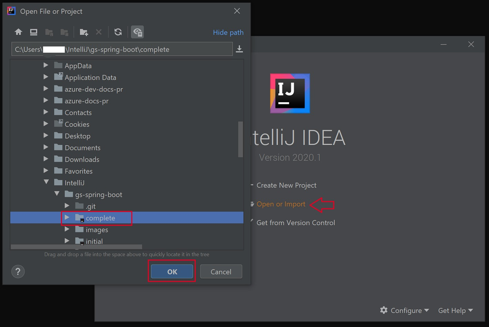

# Benutzereingabe Verzweigung und Schleifen

## Kurze Beschreibung des Projekts
- Benutzer gibt Zahlen ein 
- Zahlen werden zum rechnen genutzt 
- davor wird überprüft ob die Zahl die eingegeben wurde eine positive ganzzahl ist oder nicht 
- danach kann der User weitere zahlen eingeben mit denen dann etwas gerechnet wird 

## Installationsanleitung
- Dafür wird nur IntelliJ benötigt um dieses Programmierbeispiel ausführen zu können

## Wie wird das Projekt verwendet?

- User muss wie oben erwähnt positive ganzzahlen eingeben, um das Programm ausführen zu können.

  
  [Link](https://moodle.campus02.at/pluginfile.php/148346/mod_resource/content/0/uebungsbeispiel4.pdf)  